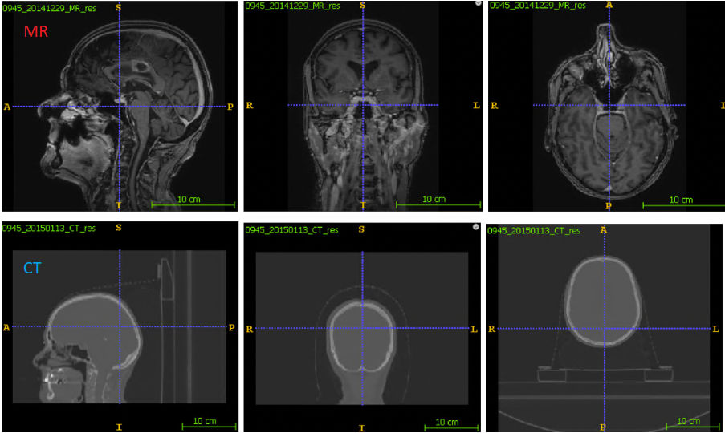
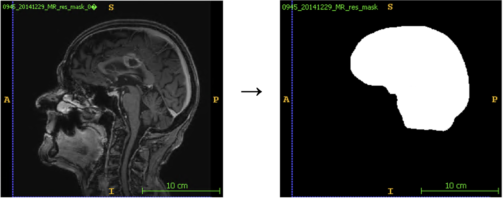
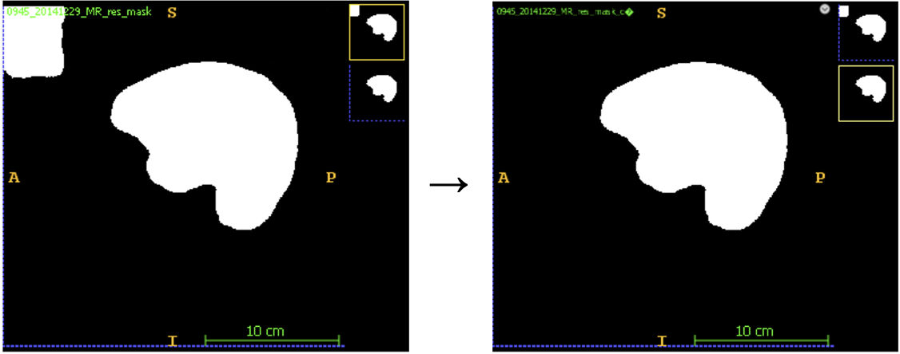
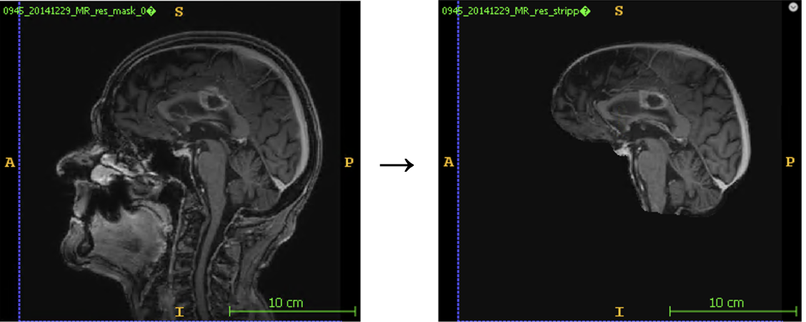
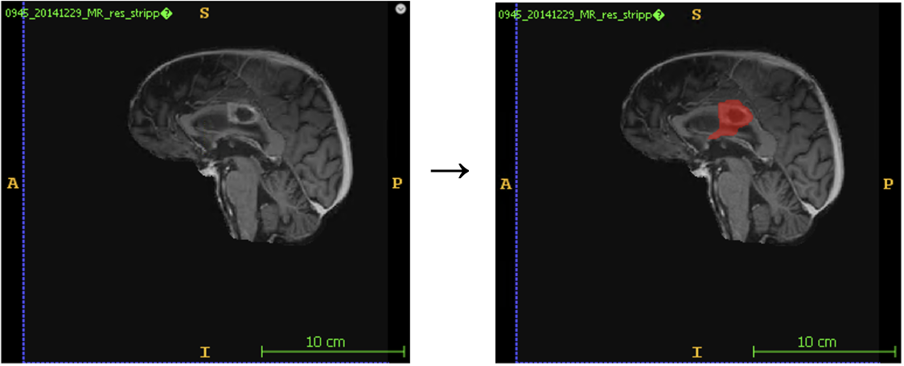
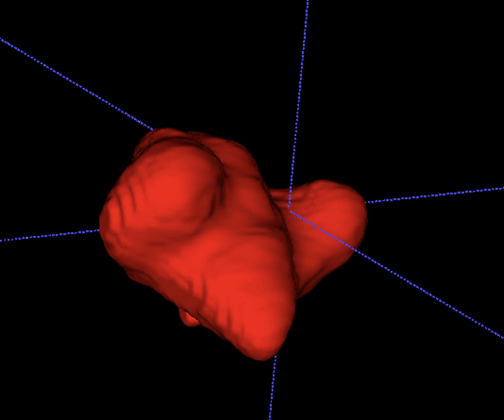
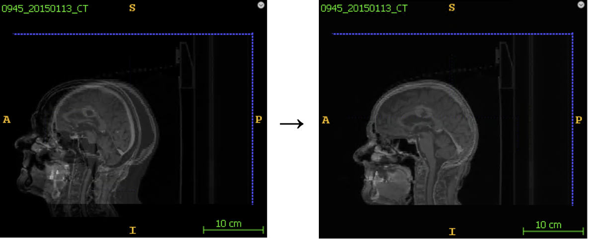

# README

Following is a description on how to use and the different steps of our data analysis pipeline which takes in radiology scans (MR and CT) from patients suffering from glioblastoma and returns an analysis of relevant metrics based on the scans.

## Description of the pipeline
The figure below illustrates the input and resulting output of each step in the pipeline. These steps are described in further detail in the sections below.

### Input Data

For each patient, the pipeline takes as input up to four MR scans from different timepoints as well as a single CT scan. The scans are 3D images. Whereas 2D images are made up of pixels, 3D images are made up of voxels. Each voxel represents the brightness in the scan of a small cuboid volume. The number and size of the voxels vary with each scan, but a typical MR scan is 520x520x176 voxels with each voxel having a size of 0.5mm x 0.5mm x 1.0mm. An example of a MR scan and a CT scan can be seen in the below illustration.

The table below gives an overview of the possible different scans for each patient. It shows the chronological order of the scans, what type of scan is made at each time stamp, a description of each scan and what the different time stamps are called in the code. Some patients don't have all of the below mentioned scans. 

| Name in code | Title        | Description                                         | Scan type(s) |
|--------------|--------------|-----------------------------------------------------|--------------|
| time0        | Diagnosis    | Scan used to diagnose the patient with GBM.         | MR           |
| time1        | Post surgery | Scan done right after  surgery to the check result. | MR           |
| time2        | Planning     | Scans used to plan the  radiation therapy area.     | MR and CT    |
| time3        | Recurrence   | Scan from when the tumor  is starting to recure.    | MR           |

Besides the scans, the pipeline also takes a patient journal for each patient as input. This journal includes information about the dates of the different scans as well as the treatment intensity. The section "Technical Details" below describes this journal and the required format of the input data in further detail.

### Brain Segmentation (MR and CT)
The first step of the pipeline is brain segmentation. The pipeline activates the brain segmentation by running the function "*run_brainmask_predictions*" located in the script "*brain_segmentation/predict_brain_masks.py*". This function performs the brain segmentation on the CT scan and each of the MR scans for the patient. The result of the brain segmentation is a separate 3D file called a brain mask, where voxels that are part of the brain have value 1 and 0 otherwise. For each CT and MR scan the brain is segmented by using prediction from a pre-trained nnUNet model. An illustration of a MR scan and the corresponding brain segmentation is illustrated below:

The brain segmentations may include small separate objects, that are not actually part of the brain, in the brain mask. [HOW MANY? IS IT A BIG PROBLEM?] For this reason, any small objects not part of the brain are removed using the function "*cleanup_brain_mask*" which is located in the script "*brain_segmentation/cleanup_brain_masks.py*". If two neighboring voxels are 1, i.e. segmented as brain, they are considered to be in the same component. Using SimpleITK's ConnectedComponentImageFilter all components in the brain segmentation are found and labeled. If more than one component is present, the largest component is kept, since this will be the actual brain. Any other components are removed. A brain mask before and after cleanup is illustrated below. Note this is one of the more severe examples and not representative of most scans.

### Skull-Stripping

Since a brain mask for each MR and CT scan has been generated in the previous brain segmentation step, it is now possible to perform skull-stripping. The function "*run_skull_stripping*" from "*skull_stripping/strip_skull_from_mask.py*" applies the mask to each MR scan, i.e. everything from the scan that is not part of the brain mask is removed. An MR scan and its skull-stripped version is illustrated below:

### GTV Segmentation

In this step the GTV for each MR scan is segmented. The pipeline activates the GTV segmentation by running the function "*run_prediction*" from the script "*gtv_segmentation/predict_gtvs.py*". This function takes the skull-stripped MR scans from the previous step and returns a mask of the GTV. This mask is structured like the brain mask but here voxels that are part of the tumor have the value 1 and 0 otherwise. The segmentation is again created by using predictions from a pre-trained nnUNet model. A skull-stripped MR scan and the same scan with the segmented GTV marked in red is illustrated below: 

The segmented GTV illustrated in 3D:

### Registration: MR to CT grid
Each MR scan is registered to the grid of the CT scan using the function "*register_MR_to_CT*" from "*registration/registration_MR_mask_to_CT_mask.py*". To perform the registration using SimpleElastix, we need the brain masks from the brain segmentation step. The final registration is a result of two separate rounds of registration: 

In the first round the brain masks are used to skull-strip the MR and CT images, which allows us to align the scans at the center of gravity of the brains to get a decent starting point for the first round of registration. The first round can be considered a rough registration. In the second round we replace the skull-stripped scans by the original scans - now at the position where we left off at the first round - and the parameters in this round of registration are used to fine-tune the registration. When the MR scan has been registered to the CT grid, the corresponding brain mask and GTV are moved along with the registered MR scan.

An MR scan and a CT scan in the grid of the CT before and after registration are illustrated below: 

After all MR scans for the patient have been registered, the performance of the registrations are evaluated using the function "*add_msd_to_json*" from the script "*registration/mask_registration_evaluation.py*". The mean surface distance in mm between the brain mask of each MR scan and the CT scan is calculated and saved in a JSON file.

### Data Analysis
Now that the GTV's have been moved onto the CT grid in the previous step, it is possible in this final step to analyze the tumors of the patient using the function "*run_patient_metrics*" from "*analysis/patient_metrics.py*". For each patient, different metrics and recurrence type categorizations are performed. One of these metrics is not sufficient to describe the type of recurrence, but together, they can aid in describing the recurrence. For each time point 'time0', 'time1', 'time2' and 'time3' the following metrics are calculated:

- The **number of days since 'time2'** ('time2' is the time point of treatment planning and considered the "baseline". This means the number of days since 'time2' will be negative for 'time0' and 'time1', and will always be 0 for 'time2').
- **Number of lesions** (patients may have one big tumor or multiple smaller lesions)
- The **volume of each lesion**
- The **total volume** of all lesions
- The **percentage growth in volume since the first available scan**
- The **percentage growth in volume since the baseline** ('time2')

At the point of recurrence, 'time3', the following is also calculated:

- **The target dose** (54 Gy or 60 Gy) is determined using the maximum intensity of the radiation therapy planning image. This is cross-checked with the available clinical treatment data for the patient.
- **The percentage overlap of the GTV with the 95% isodose area** - if the target dose is 60 Gy, the 95% isodose area is any part of the brain that receives more than 95% of 60 Gy.
- **The Hausdorff distance** between the recurring GTV at 'time3' and the baseline GTV at 'time2'. (see p. 19 [here](https://www.researchgate.net/publication/359797561_Common_Limitations_of_Image_Processing_Metrics_A_Picture_Story)) The 95% percentile Hausdorff distance is also calculated

Finally, the type of recurrence is also categorized in two different ways:

**A "classical" categorization of the recurrence type** determined by the overlap between the recurring GTV and 95% isodose area. Specifically, the recurrence is calculated according to the following rules:

- central: 95% of recurrence volume within the 95% isodose line
- in-field: 80-95% of recurrence volume within the 95% isodose line
- marginal: 20-80% of recurrence volume within the 95% isodose line
- distant: <20% of recurrence volume within the 95% isodose line

**A visual scoring categorization of the recurrence type**, where the overlap between the recurring GTV at 'time3' is compared to the baseline GTV at 'time2'. The recurrence type falls into one of three categories:

- 1. Local-only: The recurring GTV has any overlap with the baseline GTV 
- 2. Combined: Both local-only and non-local recurrence lesions are present (note this requires at least two recurrence lesions)
- 3. Non-local: The recurring GTV has no overlap with the baseline GTV

Each patient in our data has been visually scored in this manner by a clinical professional. Because of this, we cannot expect perfect consistency with the above definition. Nonetheless, the pipeline automatically categorizes the tumor according to the definition, and the automatic categorization is checked against the clinical definition as a quality check.
 

## Result From Running on Data
[Hvor mange objekter blev fjernet i cleanup brain masks p
