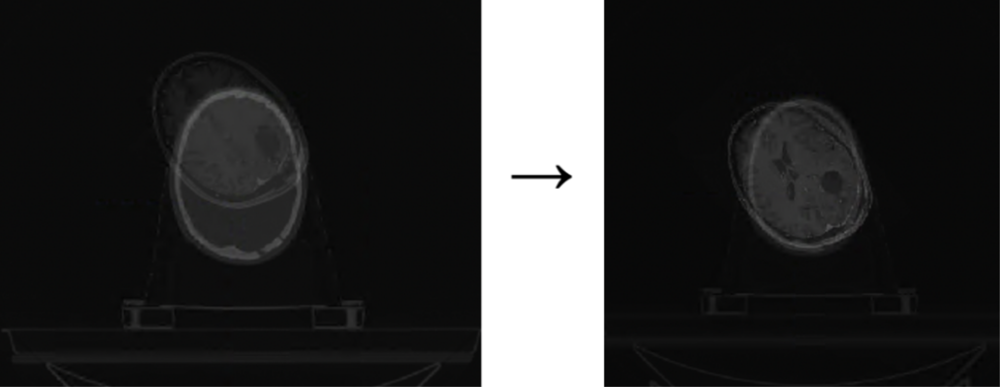
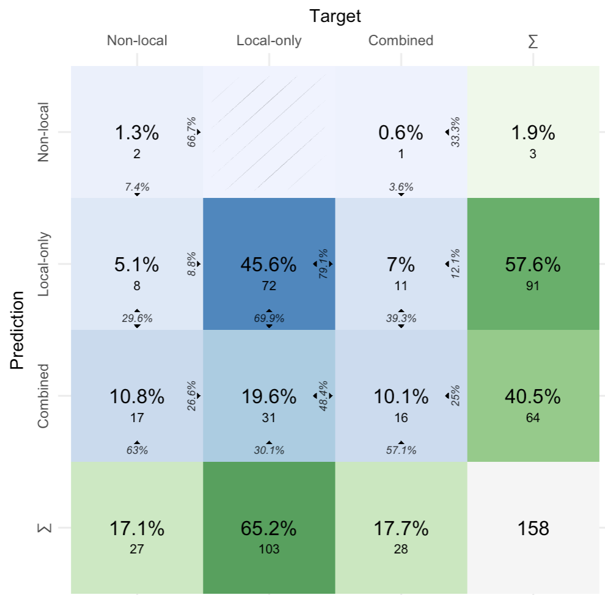

# Readme

The following is a description of the different steps of our data analysis pipeline as well as a guide on how to execute it. The pipeline takes in radiology scans (MR and CT) from patients suffering from glioblastoma and returns an analysis of relevant metrics based on the scans.

[[_TOC_]]

# Description of the pipeline
The figure below illustrates the input and resulting output of each step in the pipeline. These steps are described in further detail in the sections below.


## Input data

For each patient, the pipeline takes as input up to four MR scans from different timepoints as well as a single CT scan and a RTDOSE file, which holds info on the radiation therapy planning. The scans are 3D images. Whereas 2D images are made up of pixels, 3D images are made up of voxels. Each voxel represents the brightness in the scan of a small cuboid volume. The number and size of the voxels vary with each scan, but a typical MR scan is 520 $\times$ 520 $\times$ 176 voxels with each voxel having a size of 0.5mm  $\times$ 0.5mm  $\times$ 1.0mm. An example of a MR scan and a CT scan can be seen in the below illustration.


The table below gives an overview of the possible different scans for each patient. It shows the chronological order of the scans, what type of scan is made at each time stamp, a description of each scan and what the different time stamps are called in the code. Some patients do not have all of the below mentioned scans. 


| Name in code | Title        | Description                                         | Scan type(s) |
|--------------|--------------|-----------------------------------------------------|--------------|
| time0        | Diagnosis    | Scan used to diagnose the patient with GBM.         | MR           |
| time1        | Post surgery | Scan done right after  surgery to the check result. | MR           |
| time2        | Planning     | Scans used to plan the  radiation therapy area.     | MR and CT    |
| time3        | Recurrence   | Scan from when the tumor  is starting to recure.    | MR           |


Besides the scans, the pipeline also takes a patient journal for each patient as input. This journal includes information about the dates of the different scans as well as the treatment intensity. The section [Technical details](#technical-details) below describes this journal and the required format of the input data in further detail.


## Brain segmentation (MR and CT)
The first step of the pipeline is brain segmentation. The pipeline activates the brain segmentation by running the function `run_brainmask_predictions`located in the script `brain_segmentation/predict_brain_masks.py`. This function performs the brain segmentation on the CT scan and each of the MR scans for the patient. The result of the brain segmentation is a separate 3D file called a brain mask, where voxels that are part of the brain have value 1 and 0 otherwise. For each CT and MR scan the brain is segmented by using prediction from a pre-trained nnUNet model. An illustration of a MR scan and the corresponding brain segmentation is illustrated below:


The brain segmentations may include small separate objects, that are not actually part of the brain, in the brain mask. For this reason, any small objects not part of the brain are removed using the function `cleanup_brain_mask` which is located in the script `brain_segmentation/cleanup_brain_masks.py`. If two neighboring voxels are 1, i.e. segmented as brain, they are considered to be in the same component. Using SimpleITK's ConnectedComponentImageFilter all components in the brain segmentation are found and labeled. If more than one component is present, the largest component is kept, since this will be the actual brain. Any other components are removed. A brain mask before and after cleanup is illustrated below. Note this is one of the more severe examples and not representative of most scans.


## Skull-stripping

Since a brain mask for each MR and CT scan has been generated in the previous brain segmentation step, it is now possible to perform skull-stripping. The function `run_skull_stripping` from `skull_stripping/strip_skull_from_mask.py` applies the mask to each MR scan, i.e. everything from the scan that is not part of the brain mask is removed. The brain mask should cover the entire brain, but to ensure that no parts of the brain are removed when skull-stripping, the brain mask is expanded by 2 mm in all directions before being applied to the scan. An MR scan and its skull-stripped version is illustrated below:


## GTV segmentation

In this step the GTV for each MR scan is segmented. The pipeline activates the GTV segmentation by running the function `run_prediction` from the script `gtv_segmentation/predict_gtvs.py`. This function takes the skull-stripped MR scans from the previous step and returns a mask of the GTV. This mask is structured like the brain mask but here voxels that are part of the tumor have the value 1 and 0 otherwise. The segmentation is again created by using predictions from a pre-trained nnUNet model. A skull-stripped MR scan and the same scan with the segmented GTV marked in red is illustrated below: 


The segmented GTV illustrated in 3D:

{width=50%}

## Registration: MR to CT grid
Each MR scan is registered to the grid of the CT scan using the function `register_MR_to_CT` from `registration/registration_MR_mask_to_CT_mask.py`. To perform the registration using SimpleElastix, we need the brain masks from the brain segmentation step. The final registration is a result of two separate rounds of registration: 

In the first round the brain masks are used to skull-strip the MR and CT images, which allows us to align the scans at the center of gravity of the brains to get a decent starting point for the first round of registration. The first round can be considered a rough registration. In the second round we replace the skull-stripped scans by the original scans - now at the position where we left off at the first round - and the parameters in this round of registration are used to fine-tune the registration. When the MR scan has been registered to the CT grid, the corresponding brain mask and GTV are moved along with the registered MR scan.

An MR scan and a CT scan in the grid of the CT before and after registration are illustrated below: 


After all MR scans for the patient have been registered, the performance of the registrations are evaluated using the function `add_msd_to_json` from the script `registration/mask_registration_evaluation.py`. The mean surface distance in mm between the brain mask of each MR scan and the CT scan is calculated and saved in a JSON file.

## Data analysis
Now that the GTV's have been moved onto the CT grid in the previous step, it is possible in this final step to analyze the tumors of the patient using the function `run_patient_metrics` from `analysis/patient_metrics.py`. For each patient, different metrics and recurrence type categorizations are performed. One of these metrics is not sufficient to describe the type of recurrence, but together, they can aid in describing the recurrence. For each time point 'time0', 'time1', 'time2' and 'time3' the following metrics are calculated:

- The **number of days since 'time2'** ('time2' is the time point of treatment planning and considered the "baseline". This means the number of days since 'time2' will be negative for 'time0' and 'time1', and will always be 0 for 'time2').
- **Number of lesions** (patients may have one big tumor or multiple smaller lesions)
- The **volume of each lesion**
- The **total volume** of all lesions
- The **percentage growth in volume since the first available scan**
- The **percentage growth in volume since the baseline** ('time2')

At the point of recurrence, 'time3', the following is also calculated:

- **The target dose** (54 Gy or 60 Gy) is determined using the maximum intensity of the radiation therapy planning image. This is cross-checked with the available clinical treatment data for the patient.
- **The percentage overlap of the GTV with the 95% isodose area** - if the target dose is 60 Gy, the 95% isodose area is any part of the brain that receives more than 95% of 60 Gy.
- **The Hausdorff distance** between the recurring GTV at 'time3' and the baseline GTV at 'time2'. (see p. 18 [here](https://www.researchgate.net/publication/359797561_Common_Limitations_of_Image_Processing_Metrics_A_Picture_Story)) The 95% percentile Hausdorff distance is also calculated

Finally, the type of recurrence is also categorized in two different ways:

**A "classical" categorization of the recurrence type** determined by the overlap between the recurring GTV and 95% isodose area. Specifically, the recurrence is calculated according to the following rules:

- central: 95% of recurrence volume within the 95% isodose line
- in-field: 80-95% of recurrence volume within the 95% isodose line
- marginal: 20-80% of recurrence volume within the 95% isodose line
- distant: Less than 20% of recurrence volume within the 95% isodose line

**A visual scoring categorization of the recurrence type**, where the overlap between the recurring GTV at 'time3' is compared to the baseline GTV at 'time2'. The recurrence type falls into one of three categories:

1. Local-only: The recurring GTV has any overlap with the baseline GTV 
2. Combined: Both local-only and non-local recurrence lesions are present
3. Non-local: The recurring GTV has no overlap with the baseline GTV

Each patient in our data has been visually scored by a clinical professional. The definition of the different categories when scored based on visual analysis from a clinical professional is slightly different from the above mentioned definitions. They are as follows:

1. Local-only: The recurring GTV is connected to the surgical cavity, i.e. the empty space from where the tumor was removed in surgery
2. Combined: Both local-only and non-local recurrence lesions are present
3. Non-local: The recurring GTV is not connected to the area of the surgical cavity

The reason that the clinical definition isn not used in the automatic categorization is due to the fact that it is not possible to separate the surgical cavity from the GTV’s in the automatic segmentation. We therefore cannot expect perfect consistency between the two above definitions. Nonetheless, the pipeline automatically categorizes the tumor according to the first definition, and the automatic categorization is checked against the clinical definition as a quality check. 


# Results from running on data

The pipeline was used on scans from 175 different patients from Aarhus University Hospital (AUH) suffering from GBM. Here, the total number of scans amounted to 638 MR scans and 173 CT scans. Note that some patients did not have all of the five different scans described in section [Input data](#input-data) . Beside the scans, the data in the test run also consisted of a patient journal containing the required information (see the section on [required data and format](#required-data-and-format)) about the 175 patients and 173 RTDOSE files. All the data was preprocessed to comply with the required structure as described in the section [Required data and format](#required-data-and-format).

The three following subsections describe three different ways of measuring how the pipeline performed on the data.

## Small objects outside brain masks

During the process of [brain segmentation](#brain-segmentation-mr-and-ct) on the AUH data, a total of 84 brain mask predictions had small connected components not connected to the main brain. The total number of MR and CT scans in our dataset was 811, so 10.4% of the scans needed to be cleaned up. This is possibly caused by a small subset (3 CT scans and 24 MR scans) of the training material also having small objects outside the brain. The prediction error did not, however, prove to be an issue after the brain mask cleaning.

## Registration performance

As seen in the histogram, most [registrations](#registration-mr-to-ct-grid) have mean surface distance (MSD) scores below 2 mm. These are good registrations. If the MSD score is large, it is typically one of these two cases:


**A.** A small number of the MR scans have incomplete brain masks, which causes the MSD between the brain masks to be large. For most examples in this case the registration is fine, so the large MSD is not an issue. However, something might have caused the brain mask to be incomplete, so the analysis might be flawed, but the registration will still do fine. Below is an example of a good registration with an incomplete brain mask. Here the MSD is 6.57 mm.


**B.** The MR scan is rotated in comparison to the CT scan, and the registration has not been able to fix the rotation issue. The bad registration might cause the analysis to be flawed. This problem is often combined with an incomplete brain mask, but there is one example of a bad registration, where the brain mask is fine. Here the MSD reflects the bad registration performance. Below is this example of a bad registration with a rotation issue. Here the MSD is 5.65 mm.




## Accuracy of automatic recurrence type categorization

As mentioned in the [data analysis](#data-analysis) section, an automatic categorization of the recurrence corresponding to the visual scoring is performed for each patient. The below confusion matrix illustrates how the predictions compare to the true target values. 

We should expect to see at least some consistency between the predictions and the target values, even though slightly different definitions are used for the target and prediction values. 

{width=50%}


Each of the nine cells in the top-left represents a combination of a combination between a prediction and a target. 


For example, 17 out of 158 or 10.8 % of all prediction-target pairs were “non-local”-”combined”, that is, the target was “non-local” and the prediction “combined”. Out of all the “non-local” targets, 63% were predicted to be “combined”, and out of all the recurrence types predicted as “combined”, 26.6% were in fact “non-local”.

The green column and row represent the sum of each row or column, respectively.

In total, 56.9% of the predictions were correct. It is apparent immediately that the guesses are far from perfect. In fact, a naive model only predicting “local-only” would have an accuracy of 65.2%. However, because the guesses are based on automatic segmentation and registration, and because the targets and predictions cannot be compared one-to-one, the results are not terrible. They do allow us to identify a few issues, however. 

Firstly, the model has only predicted “non-local” three times even though 27 out of 158 patients had “non-local” recurrences. One of the primary reasons for this is the difference in the definition of the three recurrence types between the automatic categorization and the clinical. As explained previously in the section [Data analysis](#data-analysis), this is because it is not possible to separate the surgical cavity from the GTV when performing GTV segmentation. This causes the surgical cavity to be segmented as part of the GTV, which in turn affects the categorization.

Secondly, the model has categorized 31 “local-only” recurrences as being “combined”. This can also be explained by the fact that the surgical cavity may be marked in the GTV segmentation, as illustrated in the following scenario: Assume that a patient has a recurrence that is truly “non-local”. The GTV segmentation will then mark the new, non-local lesion, but it will also mark the surgical cavity as being GTV. This leads to one “non-local” lesion (the true new lesion) and one “local” lesion (the surgical cavity being categorized as GTV), thus giving a categorization as “combined”.

For the same reasons, although we have no "true" values to compare against, we can expect the classical recurrence type predictions to be leaning too heavly towards "Central".  A summary of the classical recurrence type categorization can be seen below:

|          | n    | Proportion |
| -------- | ---- | ---------- |
| Central  | 121  | 76.6%      |
| In-field | 14   | 8.9%       |
| Marginal | 18   | 11.4%      |
| Distant  | 5    | 3.2%       |

## ??? Small conclusion : How do we think the pipeline performs, and how can it potentially be improved

???

# Technical details

The rest of this document describes how to actually set up and run the pipeline.

## Python environment
The file 'requirements.txt' can be used to create a conda environment with the required python packages.

## nnU-Net
The pipeline uses the deep learning software nnU-Net to perform brain and GTV segmentation. A guide on how to set up and train a nnU-Net model, as needed in the pipeline, can be found at the [GitHub site for nnU-Net](https://github.com/MIC-DKFZ/nnUNet). 

The pipeline assumes that there are 3 available nnU-Net models present on the machine on which it is run: One for CT brain segmentation, one for MR brain segmentation and one for GTV segmentation. Our models was trained on 638 MR scans and 173 CT scans from Aarhus University Hospital (AUH). 

## Required data and format
Both the MR and CT scans from the patients must be in compressed Neuroimaging Informatics Technology Initiative format also known as NIfTi. Files in this format have the  filename extension `.nii.gz`. The files further need to have the correct naming in order for the pipeline to be able to calculate the relevant metrics. The naming needs to correspond to the following structure: 

​	`PATIENT-IDENTIFIER`_`DATE_TYPE`.`FILE-EXTENSION`

* `PATIENT-IDENTIFIER`: a unique string that identifies the corresponding patient.
* `DATE`: the date of the given scan in the format `YYYYMMDD`.
* `TYPE`: a string that needs to be either `MR_res`,  `CT_res` or `RTDOSE_res`.
* `FILE-EXTENSION`: corresponding to the required file format `.nii.gz`.

Finally the pipeline needs a patient journal containing clinical data for each patient. The journal should contain information about the following values:


- Patient Identifier: unique identifier for each patient.
- Diagnosis Date: date of the diagnosis scan.
- Post Operation Date: date of the postoperative scan.
- Radiotherapy Date: date of the radiotherapy planning scan.
- Recurrence Date: date of the recurrence scan.
- Radiotherapy dose: the dose of radiation given in gray (Gy). 
- Progression type: the type of progression lesions.

## Folder structure
In order to run the pipeline on a dataset the data of the different patients must be stored in a certain folder structure. This is necessary to ensure that the different steps in the pipeline are able to locate the needed data. The entire dataset needs to be stored in a main input folder, which contains a subfolder for each patient. The names of the  different patient folders need to be distinct (e.g. patient id's), so the pipeline can separate the patients. In each patient folder the scans for the corresponding patient are stored. An example of this structure with the correct naming of the scans is shown below:

```
- Main
  - 0114
    - 0114_20230504_MR_res.nii.gz
    - 0114_20230507_MR_res.nii.gz
    - 0114_20230511_CT_res.nii.gz
    - 0114_20230511_RTDOSE_res.nii.gz
    - 0114_20230519_MR_res.nii.gz
  - 3443
    - 3443_20230625_MR_res.nii.gz
    - 3443_20230629_CT_res.nii.gz
    - 3443_20230629_RTDOSE_res.nii.gz
    - 3443_20230701_MR_res.nii.gz
    - 3443_20230704_MR_res.nii.gz
  ...

```

## How to run

The pipeline is run by running the script `pipeline.py`. To specify settings such as the path of the input data folder and the output folder, a `settings.json` file must be created. This file further needs to specify a task id which specifies the nn-Unet model to use for the specific tasks in the steps of the pipeline. Furthermore, the size in voxels of the dilation filters used in registration and skull-stripping can be specified. It is also possible to specify the minimum size in voxels required for a lesion to be considered a tumor. Lastly it can be specified which parts of the pipeline and on which patients a specific exectution of the pipelin is supposed to run. If the key `only_run_selected_patiens` is set to `true` the pipeline only run on the patients which `PATIENT-IDENTIFIER` is in the list of the key `selected_patients`. If nothing is specified, the default paths and settings defined in `utils.py` will be used. An example of a `settings.json` file can be seen below:

```json
{   
    "task_id_brain_segmentation_ct":  800,
    "task_id_brain_segmentation_mr":  801,
    "task_id_gtv_segmentation": 600,
    "skull_stripping_dilation_radius_mr": [4, 4, 2], 
    "registration_dilation_radius_mr": [10, 10, 5],
    "registration_dilation_radius_ct": [5, 5, 5],
    "minimum_lesion_size": 20,
    "path_data": ".../glioblastoma/input_data/",
    "path_journal": "info/gbm_treatment_info.csv",
    "path_output": "output/",
    "run_brain_segmentation": true,
    "run_cleanup_brain_masks": true,
    "run_skull_stripping": true,
    "run_gtv_segmentation": true,
    "run_registration": true,
    "run_registration_evaluation": true,
    "run_data_analysis": true, 
    "only_run_selected_patients": true,
    "selected_patients": ["0114", "0540"]
}
```
When the above-mentioned process has been done, the pipeline can be executed by running the 'pipeline.py' file. 
