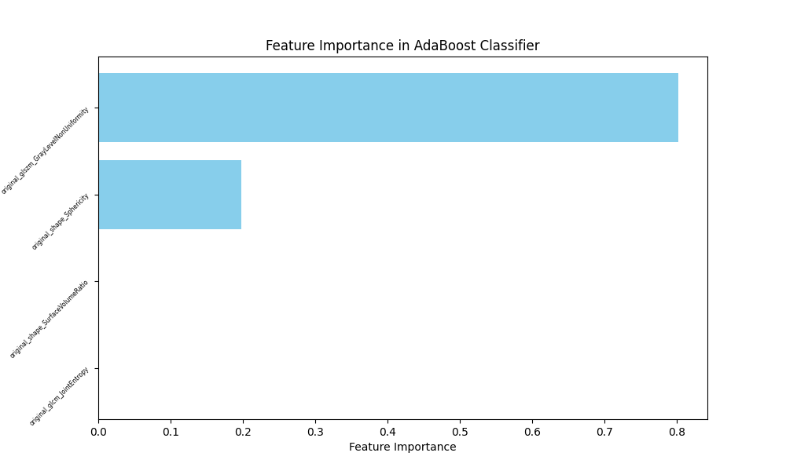

# Introduction

# GTV segmentation | nnUNet

# Radiomics
Glioblastoma (GBM) is generally expected to reoccurs after removal of the tumor. The recurrent tumor(s) can be:
* Local: The recurrent tumor overlaps with the earlier removed tumor.
* Distant: The recurrent tumor does **not** overlap with the earlier removed tumor.
* Combined: There are both local **and** distant tumors.

  

  
  

**Goal:** Be able to predict whether or not a recurrence will have a distant tumor.

This is important as being able to predict if a recurrent tumor is distant or not, may allow treatment during radiotherapy to focus on a concentrated area around the removed tumor in the case of only local recurrence, 
or a broader radiation area in the case of a distant recurrence.

Prediction will be made by extracting textural, shape-based and statistical features about the ring (sphere) around the gross tumor volume (GTV, i.e. the tumor) in the MR scan made during planning of radiotherapy.
The features are then used to fit a logistic regression model and used to train an ADABoost classifer.

**Process:**
* Create CTV ring
* Extract features from MR using ring as region of interest
* Feature selection
* Prediction using logistic regression
* Prediction using ADABoost

## Data
Number of available and suitable images are:

  
| Type     | Amount |
|----------|--------|
| Local    | 274    |
| Distant  | 115    |
| **Total**    | 389    | 

Recurrences for all images are classified by a single doctor. The tumor is segmented by various doctors in their respective hospital. 

## Creating the CTV ring
Creating the CTV ring needs the following resources:
* Clinical delineation of gross tumor volume.
* MR from planning phase of radiotherapy
* Segmentation of brain (Retrieved through pipeline)

The CTV is the GTV with some margin, here: 2 cm.

**Process of creating the ring:**
1. The largest lesion (i.e. tumor) is kept. The image can contain small parts of tumor, which will mess with the extraction of meaningful radiomic features, thus all lesser tumor are removed.
2. The area of the GTV is dilated (enlarged) by 2x2x1 cm. (Can be interpreted as dragging a sphere around the circumfrence of the GTV)
3. Keep the intersection of the dilated GTV and the brain mask; this ensures that the dilated GTV does not cross the anatomical boundary (i.e. the skull). Now we have CTV seen in image B.
4. The non-dilated GTV is removed from the CTV, resulting in a ring (hollow sphere) around the GTV. Final CTV ring can be seen in image C.

  
    

## Feature extraction
Extract features from MR using CTV as region of interest. This is done with python
module pyradiomics. Extracted features are:
* First Order Statistics (19 features)
    + _First-order statistics describe the distribution of voxel intensities within the
image region defined by the mask through commonly used and basic metrics.
e.g. Max and mean of voxel intensities_
* Shape-based (3D) (16 features)
    + The 3D shape of the region of interest.
* Grey Level Co-occurrence Matrix (21 features)
* Grey Level Run Length Matrix (16 features)
* Gray Level Size Zone Matrix (16 features)
* Neighbouring Gray Tone Difference Matrix (5 features)

**Totalling 107 features.**
  
_The matrices are essentially textural features describing properties of the local distribu-
tion of the gray levels within the ROI based on co-occurrence of gray levels, consecutive
sequence of pixels or zones with the same gray level. The intensity of a pixel or voxel is
also called a grey level or grey tone_

## Feature selection
We use the Mann-Whitney U test (also called the Wilcoxon rank-sum test) to decide which features to use on the time 2 data. Here we take each feature for all of the patients, and conduct the Mann-Whitney test on the 2 classes. If we do not have a significant p-value, we do not take the feature into account. It should be noted that we have equal number in the first class, as we have in the second class. This is important for both the selection and the prediction. To exclude multicollinearity we use the pearson's cross-correlation to test, and test weither the correlation is over 0.9. If it is, we exclude one of the features to remove the cross-correlation. 

A relative high significance level should be set, otherwise no features will be selected. When testing with a significance level of 20\% we get the following features: _Shape flatness, Minimum voxel gray level, GLDM: Small Dependence Low Gray Level Emphasis_

## Predict using logistic regression
We use logistic regression to classify whether or not a patient will have a local or distant recurrence, based on the features we have selected from the previous section. We run logistic regression on different combinations of the index, to see which ones match the best. This can be somewhat time-consuming for a lot of indices. We split the data into a train and test set. We do not achieve a prediction accuracy that is higher than what we can classify as random. Furthermore, it does not seem from the box plots that the data is separable by a logistic regression curve.
48% accuracy.

## Predict using ADABoost
The ADABoost classifier can be seen as a more all-in-one solution to the classification problem. The solution we have implemented is as follows.

First, we try to make ADABoost select the most important features, based on cross-validation. We train a new model on each of the folds we have, and get the features that is most important for ADABoost in making its prediction. We then average the importance over all of the folds and then use the top most important features. We then run ADABoost for the selected features, fit the data on a train test and then we predict on a test set. We do not observe values of anything worth writing home about, as the accuracy usually hovers around 55\%.

'original_shape_Sphericity', 'original_glszm_GrayLevelNonUniformity', 'original_ngtdm_Contrast', 'original_shape_SurfaceVolumeRatio'

4 features, 50%

