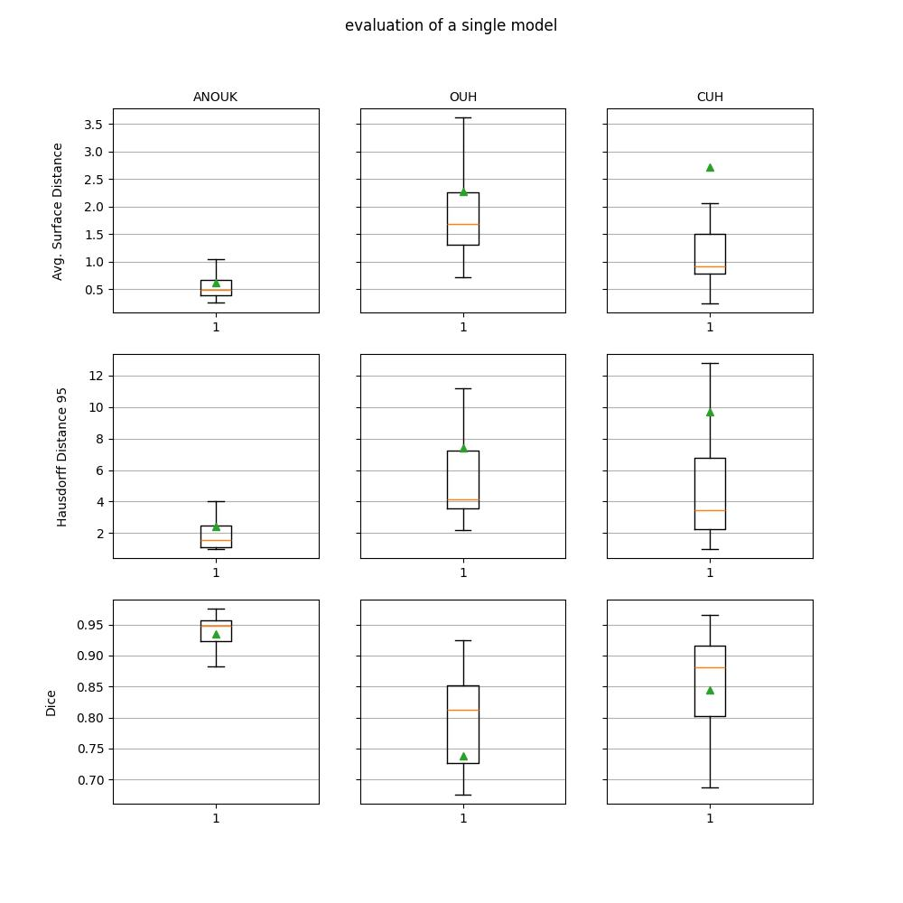
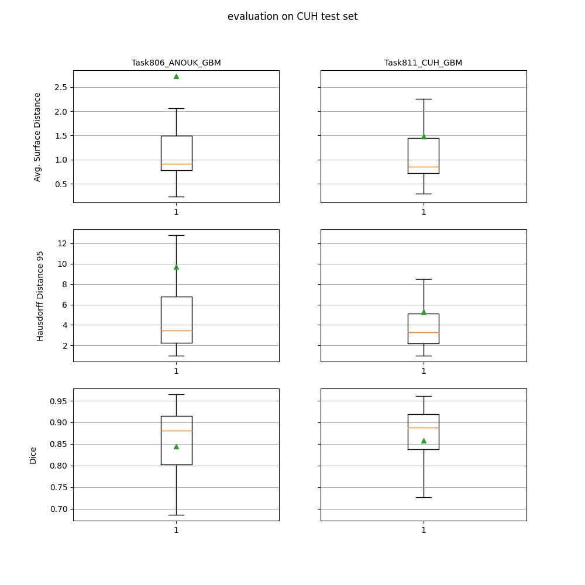
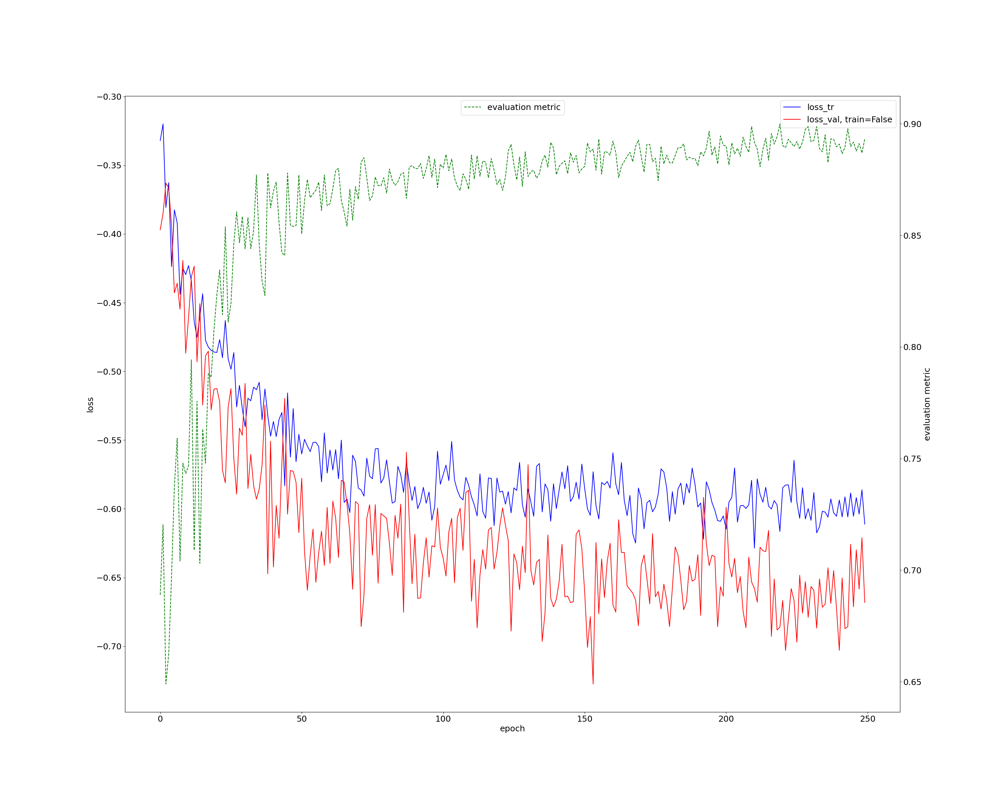
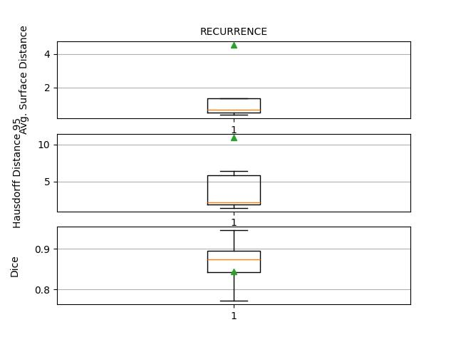

# Introduction
In this project, the goal is to analyze and predict recurrence patterns in patients with glioblastoma (GBM) - the most aggressive form of brain cancer, with a median survival time of only 15 months. The treatment consists of maximal tumor resection (removal) followed by chemotherapy and radiotherapy. For the majority of patients, the tumor will eventually recur. The recurrence can be local, distant, or combined (both local and distant) and varies between patients. The primary objective of this project is to expand an existing pipeline to predict these recurrence patterns based on data from 389 patients. This is particularly relevant because in the case of local recurrence, intensifying radiation given at the original tumor site can be considered to achieve better clinical outcomes, as opposed to a larger general treatment area in the case of distant recurrence.

* Local: The recurrent tumor overlaps with the earlier removed tumor.
* Distant: The recurrent tumor does **not** overlap with the earlier removed tumor.
* Combined: There are both local **and** distant tumors.

  

  
  

_Example of recurrence types. Red area is original tumor while green area is the recurrence. The left image shows local recurrence while right image shows a distant recurrence._

**General tumor volume (GTV) segmentation with nnUNet**

To assist in improving the prediction process, automatic segmentation of the gross tumor volume  (GTV, i.e. the tumor)  at the planning phase and time of recurrence is conducted. This means less need for manual clinical delineations (manually segmenting the GTV) of both planning and recurrence, and means automatic classification of ground truth needed for training the prediction models. It also allows automatic information retrieval of how much radiation the tumor residue recieved during radiotherapy and also how much the area of the recurrent tumor recieved, which can be included in the prediction model to provide better results.
An already established pipeline segments GTVs from the planning phase images, however this project has improved such segmentation network while also implementing a network capable of segmenting the recurrent tumors.

**Radiomics**

The goal is to be able to predict whether or not a recurrence will have a distant tumor. Prediction will be made by extracting textural and shape-based quantitative metrics (radiomic features) from the ring around the GTV in the MR taken in connection with planning of radiotherapy. The features will be used to train a logistic regression model and also an ADABoost classifier.

# GTV segmentation | nnUNet
The goal is to train models that are able to segment tumors on planning MR scans (T2 scans) and MR scans with recurrence tumors. ###Furthermore find out if models should be created specifically to each different hospital.###

## Data
Number of available and suitable images are:

  
| Type         | Training | Test |
|--------------|----------|------|
| ANOUK        | 207      | 52   |
| AUH          | xxx      | xx   |
| OUH          | 130      | 32   |
| CUH          | 156      | 39   |
| RECURRENCE*  | 31       | 8    |

*: RECURRENCE_DIALATED_CAVITY_EXCLUDED_GBM is the data for RECURRENCE 

The specific scans used for the segmentation training is the T2 MR scans which are the scans taken after the tumor was removed. The segmentations should include the cavity.

The recurrence data are scans of recurring tumors which are deliniated by Anouk. In the recurrence scans the cavity is allways excluded in the deliniation. Below can be seen a deliniation of a recurrence scan (left) and a t2 mr scan (right).

  

    
      
  

  
For further details of the data, take a look at the old readme file: old_readme_file.md
## Segmenting T2 MR scans (planning MR scan)

Our goal was to segment tumors on MR scans. We've had different data sets available, since the tumors on the MR scans in the Anouk dataset was delineated with focus on training models for tumor segmentation in contrast to the data sets from AUH, OUH and CUH where there were clinical deliniation from different doctors (not as precise). We trained a network only on the data from Anouk as baseline network to do transfer learning from so we could explore the possibility to finetune a network to each different hospital. 
Since finetuning was our end goal we only used one fold from the ANOUK network (165 training and 42 validation cases), the model was trained for 1500 epochs. In the figure below a progression curve can be seen:
  

  
  

To interpret the progression curve, see under the chapter Model Training at the page:
https://github.com/MIC-DKFZ/nnUNet/tree/nnunetv1

In the following 3 boxplots it can be seen how the different networks (ANOUK, OUH-finetuning, CUH-finetuning) perform different test sets. We have chosen not to include AUH since there is an overlap between the test and training data between ANOUK and AUH data patientwise.
  

  
  

  In the above boxplot you can see how the single model, ANOUK-network performs on different testsets: ANOUK data's own test set, OUH's testset and CUH's test set.
we wanted to see if finetuning this model to a specific hospital would result in greater results. It can be seen that the ANOUK model performs significantly worse on the OUH and CUH test set, which is expected because of the noisy clinical deliniations of the OUH and CUH MR scans.
In the two boxplots below the performance of the two finetuned networks can be seen. The two networks was the original ANOUK network finetuned with a learning rate of 1e-6 for 350 epoch on a single fold in the 5 fold cross validation.

  (POSSIBLE REFERENCE TO JASPER PAPER!!!)
  

  
  

  
NOTE: FIND DET MR SCAN DER FUCKER MEAN OG VIS SEGMENTERINGERNE.
In the above boxplot where we compare the base ANOUK network to OUH finetuned network at appears that it is performing slightly worse. And therefore thsi finetuning wasn't worth it.

  

  
  

When finetuning to CUH it looks as if the performance has increased after finetuning, since we get slightly lower values across all metrics.

Increased variance on the dice boxplot may be caused by tumor volumes differing?

Hausdorf distance 95th percentile (HD95): a distance metric that measures the maximum of the minimum distances between the predicted segmentation and the ground truth at the 95th percentile.

Mean surface distance (MSD): This tell us how much, on average, the surface varies between the segmentation and the GT.

DICE: The Dice coefficient is a measure of the similarity between two sets, A and B. The coefficient ranges from 0 to 1, where 1 indicates that the two sets are identical, and 0 indicates that the two sets have no overlap. 

DICE is very dependent on volume and therefore might be a somewhat useless metric, but it is an easy metric to understand compared to MSD and HD95. MSD and HD95 is a better way to actually compare how good a model is performing, so we decided to include all three. 

## Segmenting recurrence MR scans
The goal for Task812_RECURRENCE... is to segment the recurrence tumors. When segmenting a recurrence tumor there are som different clinical definitions of when to include the cavity and when not to which is hard for a network to learn. Therefore we have finetuned the network on MR scans where the cavity is allways excluded, which is different from the segmentations of t2 scans. In the figure below an example of a segmentation of a recurrence tumor can be seen.
So the increased variance on the dice boxplot may be caused by tumor volumes differing.

  

  
  

  
To segment the recurrence MR scans the newtork generated from Task806_ANOUK_GBM was finetuned on a training set consisting of XXX MR scans (XXX training cases and XXX test cases).
5 fold cross validation was used in the training to optimize the models performance. When segmenting a recurrence tumor an ensemble is created from the 5 folds (maybe this sentence can be written better). The ensemble prediction is created by averagin the 5 probability maps (one for each model). MAYBE PUT IN A FIGUE OF 5 probability maps.
through experimenting a learning rate of 1e-6 was determined best suitable for finetuning the network. in the figure below a progression curve from one of the folds can be seen.

  

  
  

## Results
After finetuning the network it can be seen that the cavity is now excluded from the segmentations. (see figure below)

  
    

The performance of the network is:
  

  
  

# Radiomics
**Goal:** Be able to predict whether or not a recurrence will have a distant tumor.

This is important as being able to predict if a recurrent tumor is distant or not, may allow treatment during radiotherapy to focus on a concentrated area around the removed tumor in the case of only local recurrence, 
or a broader radiation area in the case of a distant recurrence.

Prediction will be made by extracting textural, shape-based and statistical features about the ring (sphere) around the gross tumor volume (GTV, i.e. the tumor) in the MR scan made during planning of radiotherapy.
The features are then used to fit a logistic regression model and also used to train an ADABoost classifer.

**Process:**
* Create CTV ring
* Extract features from MR using ring as region of interest
* Feature selection
* Prediction using logistic regression
* Prediction using ADABoost

## Data
Number of available and suitable images are:

  
| Type         | Amount |
|--------------|--------|
| Local        | 274    |
| Distant      | 115    |
| **Total**    | 389    | 

Recurrences for all images are classified by a single doctor. The tumor is segmented by various doctors in their respective hospital. 

## Creating the CTV ring
Creating the CTV ring needs the following resources:
* Clinical delineation of gross tumor volume.
* MR from planning phase of radiotherapy
* Segmentation of brain (Retrieved through pipeline)

The CTV is the GTV with some margin, here: 2 cm.

**Process of creating the ring:**
1. The largest lesion (i.e. tumor) is kept. The image can contain small parts of tumor, which will mess with the extraction of meaningful radiomic features, thus all lesser tumor are removed.
2. The area of the GTV is dilated (enlarged) by 2x2x1 cm. (Can be interpreted as dragging a sphere around the circumfrence of the GTV)
3. Keep the intersection of the dilated GTV and the brain mask; this ensures that the dilated GTV does not cross the anatomical boundary (i.e. the skull). Now we have CTV seen in image B.
4. The non-dilated GTV is removed from the CTV, resulting in a ring (hollow sphere) around the GTV. Final CTV ring can be seen in image C.

  
    

## Feature extraction
Extract features from MR using CTV as region of interest. This is done with python
module pyradiomics. Extracted features are:
* First Order Statistics (19 features)
    + _First-order statistics describe the distribution of voxel intensities within the
image region defined by the mask through commonly used and basic metrics.
e.g. Max and mean of voxel intensities_
* Shape-based (3D) (16 features)
    + The 3D shape of the region of interest.
* Grey Level Co-occurrence Matrix (21 features)
* Grey Level Run Length Matrix (16 features)
* Gray Level Size Zone Matrix (16 features)
* Neighbouring Gray Tone Difference Matrix (5 features)

**Totalling 107 features.**
  
_The matrices are essentially textural features describing properties of the local distribution of the gray levels within the ROI based on co-occurrence of gray levels, consecutive
sequence of pixels or zones with the same gray level. The intensity of a pixel or voxel is
also called a grey level or grey tone_

## Feature selection
We use the Mann-Whitney U test (also called the Wilcoxon rank-sum test) to decide which features to use on the time 2 data (planning phase). Here we take each feature for all of the patients, and conduct the Mann-Whitney test on the 2 classes. If we do not have a significant p-value, we do not take the feature into account. It should be noted that we have equal number in the first class, as we have in the second class. This is important for both the selection and the prediction. To exclude multicollinearity we use the pearson's cross-correlation to test, and test whether the correlation is over 0.9. If it is, we exclude one of the features to remove the cross-correlation. 

A relative high significance level should be set, otherwise no features will be selected. When testing with a significance level of 20\% we get the following features: _Shape flatness, Minimum voxel gray level, GLDM: Small Dependence Low Gray Level Emphasis_

_Boxplot of the 3 features' values for each class._
## Predict using logistic regression
We use logistic regression to classify whether or not a patient will have a local or distant recurrence, based on the features we have selected from the previous section. We run logistic regression on different models with combinations of the selected features, to see which model performs the best. This can be somewhat time-consuming for a lot of features. We split the data into a train and test set. We do not achieve a prediction accuracy that is higher than what we can classify as random. Furthermore, it does not seem from the box plots that the data is separable by a logistic regression curve.

The best performing model uses all 3 features retrieved in the feature selection section with an accuracy of 48% on the test set.

_Confusion matrix showing results from the final model on the test set_

## Predict using ADABoost
The ADABoost classifier can be seen as a more all-in-one solution to the classification problem. The solution we have implemented is as follows:

When fitting an ADABoost classifier, it calculates the (gini) importance of each feature. Using 5-fold cross-validation we train a new model on each of the folds we have, and get the features that is most important for ADABoost in making its prediction. We then average the importance over all of the folds and then use the top most important features. By testing on how many features to include, we found that a model using 4 features performed the best, however only with an accuracy of 50% on test set. Including features: _Shape: Sphericity, glszm: Gray Level Non-Uniformity', ngtdm: Contrast, Shape: Surface-Volume Ratio_.

_The Gini importance for each of the included features in the final model_

_Confusion matrix showing results from the final model on the test set_

# Conclusion
In conclusion, this project has laid a solid foundation for predicting GBM recurrence patterns through advanced segmentation and radiomics. 
Although our current prediction accuracies still need improvement, the methods developed and insights gained provide a strong foundation for future progress, enabling researchers to come to refine these techniques in an effort to one day provide enhanced personalized treatment strategies and improved clinical outcomes for GBM patients.
